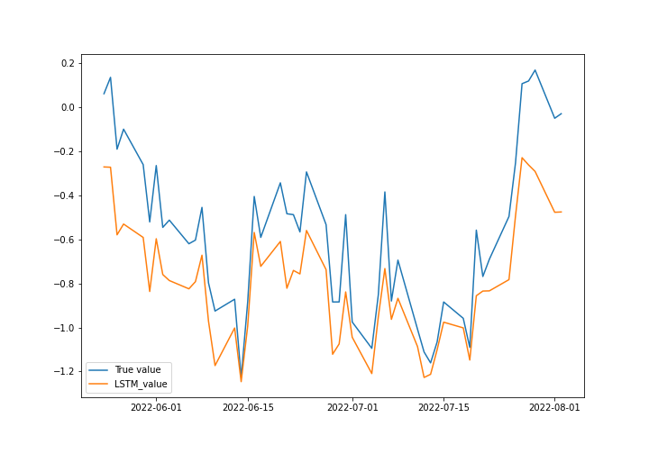

# 日経平均株価の終値の二値分類
今回は、回帰結合ニューラルネットワークを用いて、月曜から木曜までの日経平均株価の終値の時系列データから、毎週木曜日の終値が上昇するのか減少するのかを予測する.

## 構成ファイル
<a href="finance_dataset.csv">finance_dataset.csv</a> 1965年1月5日-2021年10月21日までの日経平均株価のデータ

<a href="stockprice_classification.ipynb">stockprice_classification.ipynb</a> プログラムコード

<a href="JAL,F.csv">JAL,F.csv</a>  2021年8月6日から2022年の8月6日までの日本航空の株価データ

<a href="stockprice_regression.ipynb">stockprice_regression.ipynb</a> プログラムコード

## stockprice_classification.ipynb

### 1 予測に用いた変数
曜日(月曜から木曜)、始値、最高値、最安値、終値、終値の前日比率、始値・終値の差分

### 2 予測する変数
各週の木曜の翌日の終値が上がるか否か(少々する場合は1を、それ以外は0とする)

## 3 予測に用いたネットワーク
LSTM(Long Short Term Memory)と2層の全結合ニューラルネットワークから成るモデル. 途中にDropoutを追加した. 

### 4 結果
モデルの精度は約63%となった. 直感の予測では確立的に50%の予測精度だが、機械学習を用いることで精度の向上を図ることができた. 

## stockprice_regression.ipynb

### 1 予測に用いた変数
始値、最高値、最安値

#### 2 予測する変数
終値

### 3 予測に用いたネットワーク
隠れ層32のLSTM + 一層の全結合層

### 4 結果

RSME:  0.6184121281908309\
MAPE:  2.47092105785729

## 参考文献
https://kino-code.com/python-stock-price/#i-9
